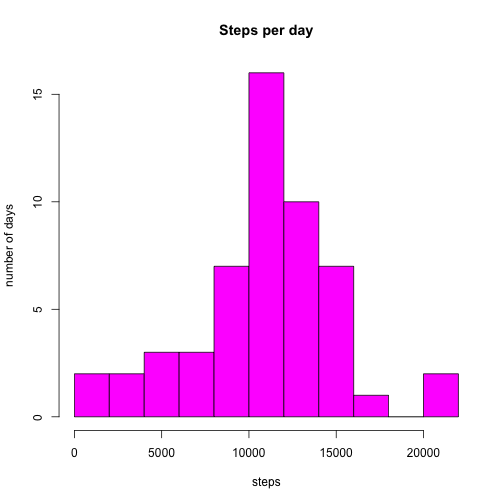
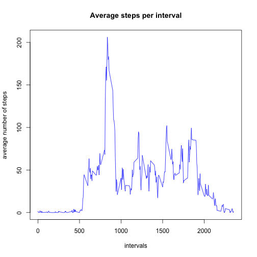
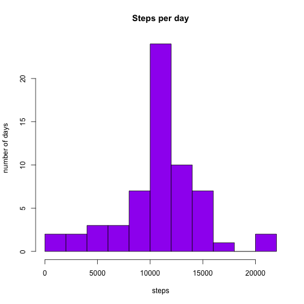
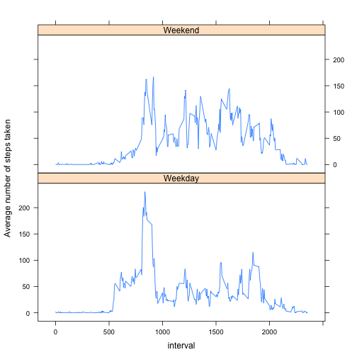

## Loading and preprocessing the data


```r
library(dplyr)
```

```
## Warning: package 'dplyr' was built under R version 3.1.2
```

```r
library(lattice)
activity<-read.csv("activity.csv")
activity1 <- activity[complete.cases(activity), ]
```

## What is mean total number of steps taken per day?

```r
activity_grouped<-group_by(activity1, date)
activity_sum<-summarize(activity_grouped,sum=sum(steps,na.rm=TRUE))
hist(activity_sum$sum, breaks=10,main="Steps per day", xla="steps", yla="number of days", col="magenta")
```

 

### Mean and median of the total number of steps taken per day


```r
mean(activity_sum$sum)
```

```
## [1] 10766.19
```

```r
median(activity_sum$sum)
```

```
## [1] 10765
```


## What is the average daily activity pattern?


```r
interval_g<-group_by(activity1,interval)
avg_interval<-summarize(interval_g, avg=mean(steps,na.rm=TRUE))
plot(avg_interval$interval,avg_interval$avg, type="l", col="blue",main="Average steps per interval", xla="intervals", yla="average number of steps")
```

 

### Interval with maximum number of steps

```r
max_avg<-max(avg_interval$avg)
avg_interval[avg_interval$avg==max_avg ,1]
```

```
## Source: local data frame [1 x 1]
## 
##   interval
## 1      835
```

  
## Imputing missing values


### Number of missing data points:


```r
length(which(is.na(activity$steps)))
```

```
## [1] 2304
```

### Histogram of the total number of steps taken each day


```r
joned_activity<-merge(activity, avg_interval, by.x="interval", by.y="interval")
j_mu<-mutate(joned_activity, newsteps=ifelse(is.na(joned_activity$steps),as.integer(joned_activity$avg),joned_activity$steps))
j_mu_grouped<-group_by(j_mu,date)
j_mu_sum<-summarize(j_mu_grouped, sum=sum(newsteps,na.rm=TRUE))
hist(j_mu_sum$sum, breaks=10, main="Steps per day", xla="steps", yla="number of days", col="purple")
```

 

### Mean and Media of total number of steps taken per day

```r
mean(j_mu_sum$sum)
```

```
## [1] 10749.77
```

```r
median(j_mu_sum$sum)
```

```
## [1] 10641
```


## Are there differences in activity patterns between weekdays and weekends?

```r
j_mu$newdate<-as.character(j_mu$date)
j_mu$newdate<-as.Date(j_mu$newdate, format="%Y-%m-%d")
j_mu$weekday<-weekdays(j_mu$newdate)
j_mu_1<-mutate(j_mu, wdwn=ifelse(j_mu$weekday %in% c("Saturday", "Sunday"), "Weekend", "Weekday"))
j_mu_1_groupled<-group_by(j_mu_1, interval,wdwn)
g_s<-summarize(j_mu_1_groupled, meansteps=mean(newsteps))
xyplot(g_s$meansteps ~ g_s$interval | g_s$wdwn, type="l",layout = c(1, 2), xlab="interval", ylab="Average number of steps taken")
```

 
